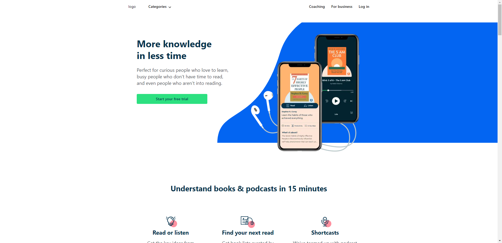
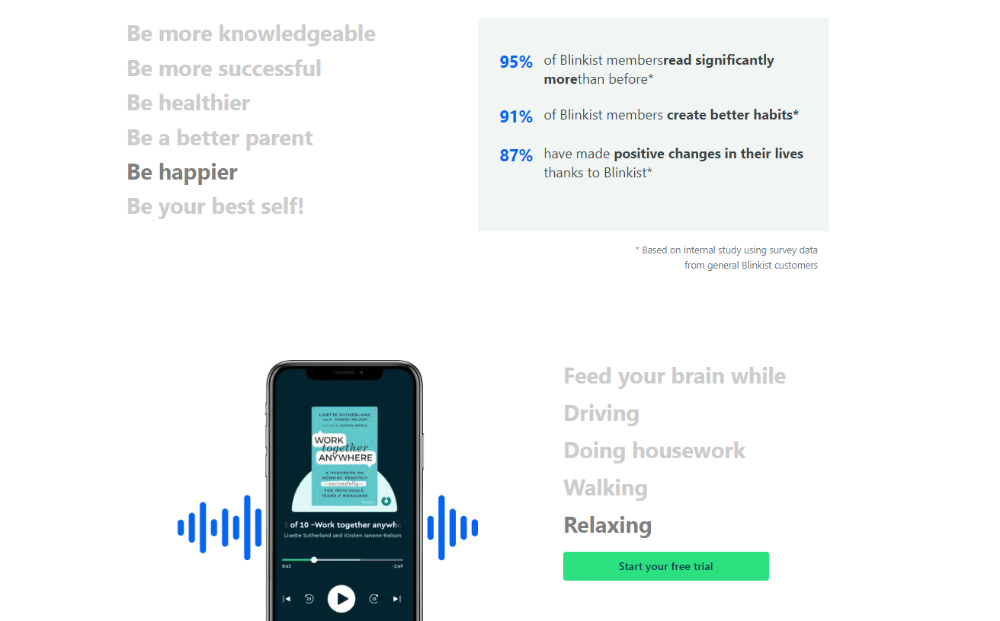
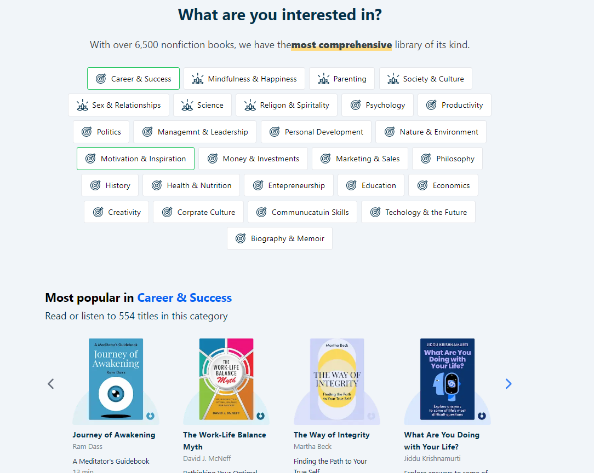
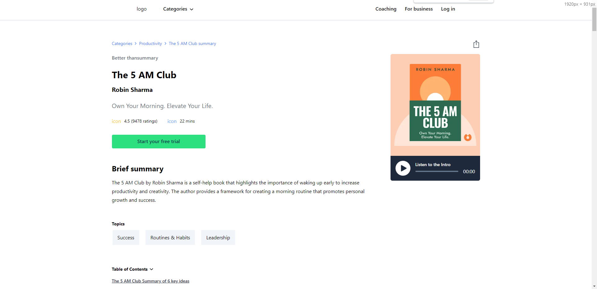
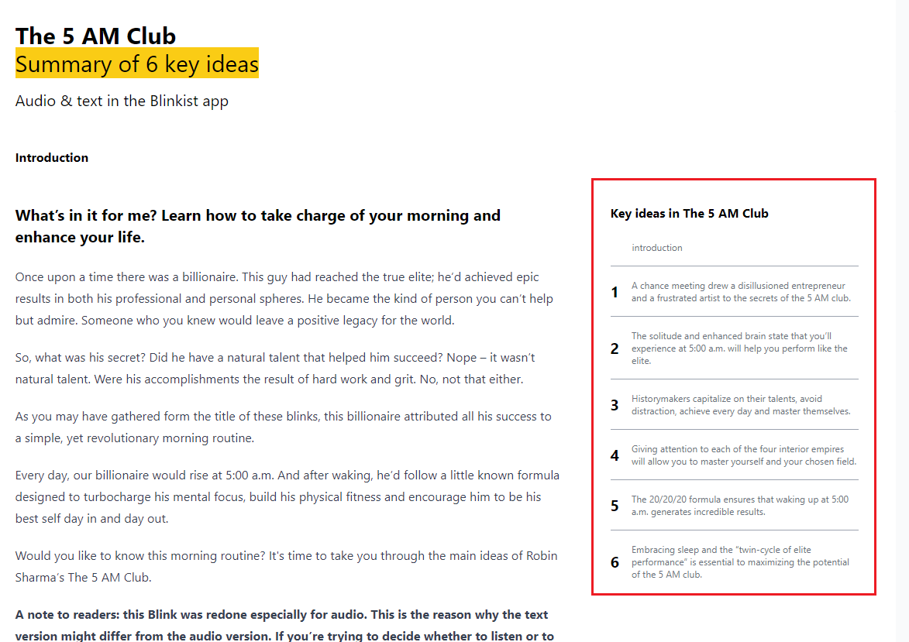
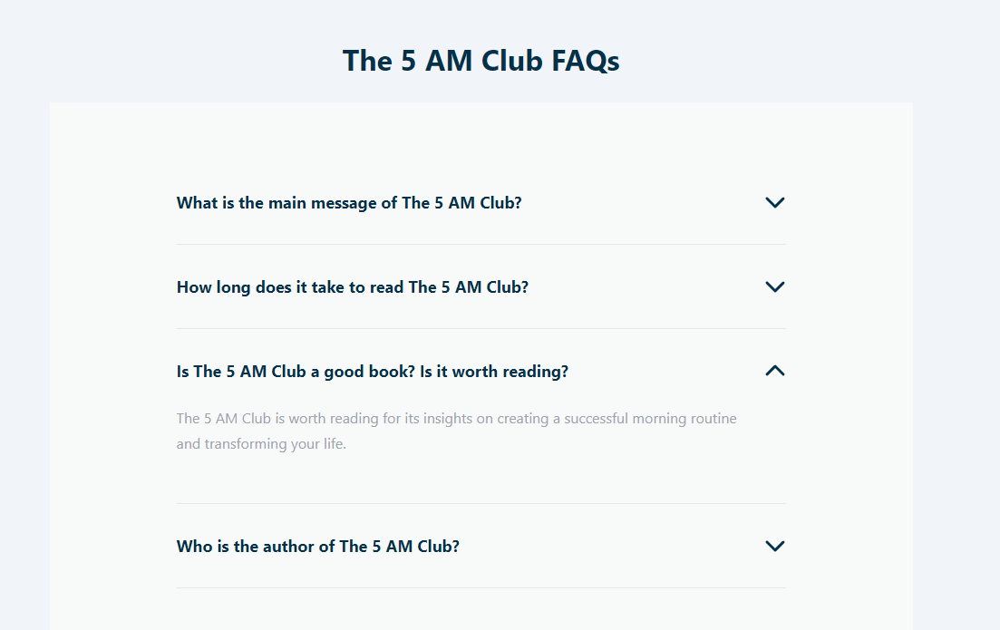

#blinkist demo

## online
### [home](https://clone-blinkist.vercel.app/home)
### [detailBook](https://clone-blinkist.vercel.app/detailBook)

## Getting Started

First, run the development server:

```bash
npm run dev
# or
yarn dev
# or
pnpm dev
# or
bun dev
```
Open [http://localhost:3000](http://localhost:3000) with your browser to see the result.

### 克隆 [blinkist](www.blinkist.com) 网站 首页和详情页


# 首页


  1. 实现页面布局
  2. 响应式(头部响应式、页面响应式)
  3. 响应式菜单栏,普通菜单栏
  
  4. 字体定时高亮
  
  5. 选中不同主题,显示不同轮播图()
  6. 轮播图功能(自定义hooks)

# 详情页

1. 页面整体布局(响应式)

2. 隐藏显示功能
3. 锚点功能

4. 切换主体文章

5. 单选问题功能

# End
